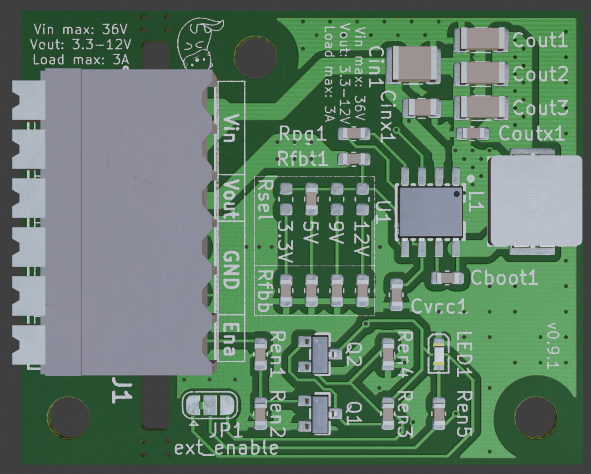

# BuckConverter with Enable Input (WIP!)

A BuckConverter based on the [Texas Instruments LM33630](https://www.ti.com/product/LMR33630). By default the converter is set to an output voltage of 5V and enabled permanently. Avaliable output levels are 3.3 V, 5 V, 9 V and 12 V. In order to select the desired output, only the corresponding `Rsel` 0 ohm resistor/connection has to be installed. 

The external enable input is enabled by cutting the builtin connection in `J1` and connectiong the solder bridge in the other direction. 

It's possible to use a [Weidmüller 1824460000 - LSF-SMT 3.50/06/90 3.5SN BK TU](https://catalog.weidmueller.com/catalog/Start.do?ObjectID=1824460000), a [PhoenixContact 1861975 - SPTAF 1 6-3,5-IL](https://www.phoenixcontact.com/de-de/produkte/leiterplattenklemme-sptaf-1-6-35-il-1861975) or a [screw terminal block from LCSC](https://www.lcsc.com/product-detail/Screw-Terminal-Blocks_DORABO-DB127S-3-5-6P-GN-S_C2997513.html) for J1. A standard 3.5 mm pitch pin header is also possible.

[Online BOM](https://htmlpreview.github.io/?https://raw.githubusercontent.com/PedPEx/BuckConverter_Enable/main/bom/webviewer-BOM.html)

---
**Note**

The pictures were rendered with the help of Blender and the [pcb2blender](https://github.com/30350n/pcb2blender) plugin and the HTML BOM was created withwith [InteractiveHtmlBom](https://github.com/openscopeproject/InteractiveHtmlBom).

---